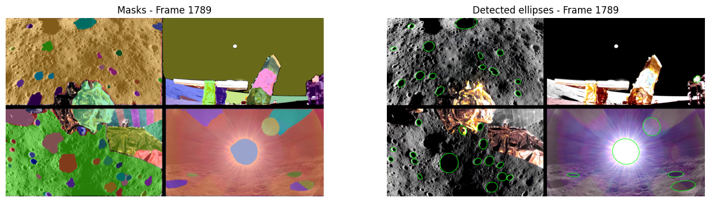

# Moon Crater Detection with Blue Ghost Descent Video

## Project Overview
This project focuses on the **automatic detection of craters on the lunar surface** using descent video data transmitted by **Blue Ghost**, the lunar lander that recently achieved a successful landing on the Moon.  

Craters are critical features of the lunar terrain, and their detection is important for navigation, hazard avoidance, and landing site evaluation.  

⚠️ **Note**: This project is currently under active development. Features, models, and outputs are subject to change as improvements are made.  

---

## Approach
The detection pipeline leverages **Meta's Segment Anything Model (SAM)**, a state-of-the-art foundation model for image segmentation.  
SAM allows us to generate pixel-accurate masks for objects in images without prior training on crater-specific datasets.  
These masks are further processed to identify **elliptical crater-like shapes**, enabling robust crater localization in video frames.

#### Key Steps
1. **Frame Extraction** – Process video frames sequentially from the Blue Ghost descent video.  
2. **Segmentation with SAM** – Apply the Segment Anything Model to generate segmentation masks.  
3. **Ellipse Filtering** – Fit ellipses to segmented regions to detect crater-like structures.  
4. **Visualization** – Annotate frames with crater masks and detected ellipses.  
5. **Export** – Save results as annotated video and CSV files containing crater parameters.  

---

## Tools & Models
- **[Segment Anything Model (SAM)](https://segment-anything.com/)** by Meta  
- Optionally, **FastSAM** (lightweight real-time alternative)  
- OpenCV for video processing and ellipse fitting  
- PyTorch for deep learning model execution  
- Matplotlib for visualization  
- Pandas for structured crater data export  

---

## Output
- **Annotated Video**: Original Blue Ghost descent video with detected crater overlays.  
- **CSV Report**: Crater coordinates, major/minor axes, and angles for each frame.  

#### Example result

  
---

## Purpose
The ultimate goal of this project is to contribute toward **autonomous lunar landing systems** by enabling real-time crater detection from descent imagery.  
By leveraging the **Blue Ghost mission data**, this project demonstrates how AI-powered segmentation can enhance landing safety, hazard avoidance, and lunar exploration mission planning.  

---
